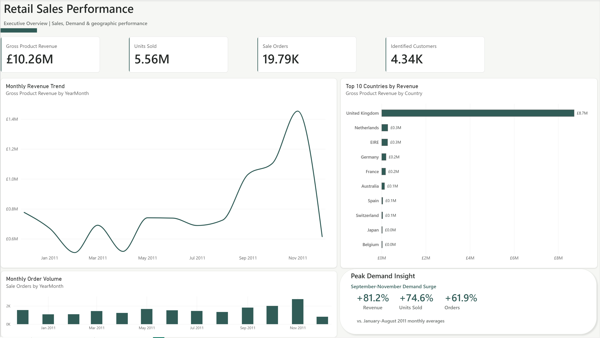
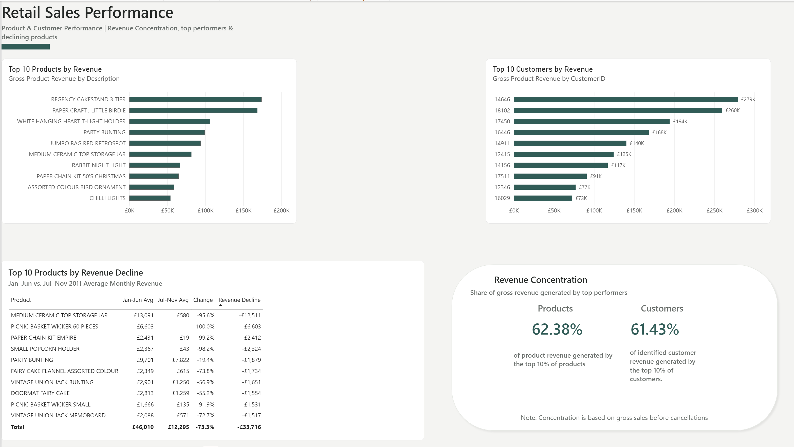
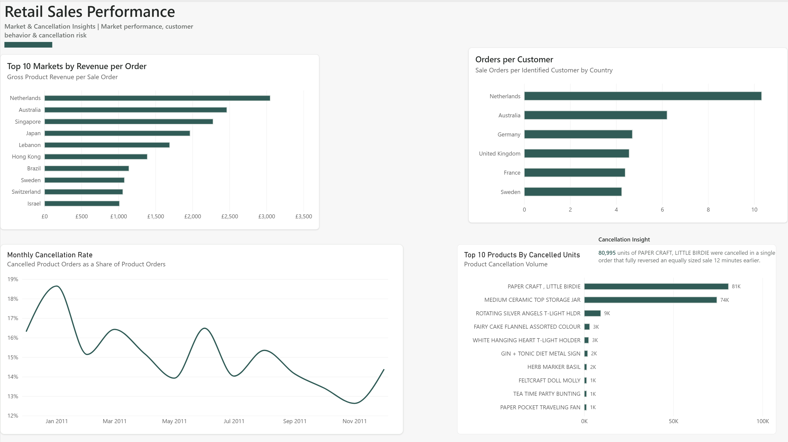

# Retail Sales Performance & Customer Analytics
End to end retail sales analytics project using SQL, Python, and Power BI to analyze sales performance, customer behavior, product trends, geographic markets, and cancellations.

The project analyzes over **500,000 retail transaction records** from the UCI Online Retail dataset, covering transactions from **December 2010 through December 2011**. The analysis transforms raw transactional data into actionable business insights and an interactive three page Power BI dashboard.

**Tools:** SQL (SQLite) • Python (Pandas) • Power BI • DAX • Google Colab

**Project Highlights:** 541K+ transactions analyzed • 10 business questions • 3-page Power BI dashboard • Customer, product, market & cancellation analysis

## Dashboard Preview

### Executive Overview


### Product & Customer Performance


### Market & Cancellation Insights



## Business Questions

This project was designed to answer the following business questions:

1. How have revenue and sales volume changed monthly and quarterly?
2. Which products generate the highest and lowest revenue?
3. How concentrated is revenue among the top-performing products?
4. Which products are experiencing declining sales or revenue?
5. Which countries generate the most revenue and sales volume?
6. Which countries underperform based on revenue, order volume, and customer activity?
7. How does customer purchasing behavior differ across geographic markets?
8. Who are the highest-value customers, and how concentrated is revenue among them?
9. What is the monthly cancellation rate, and which products or customers disproportionately contribute to cancellations?
10. What seasonal patterns exist, and what do historical trends suggest about future demand?

## Dataset

The project uses the **UCI Online Retail dataset**, which contains transactional data for a UK-based online retailer between December 2010 and December 2011.

- **Raw records:** 541,909
- **Records after duplicate removal:** 536,641
- **Original fields:** InvoiceNo, StockCode, Description, Quantity, InvoiceDate, UnitPrice, CustomerID, and Country
- **Primary analysis scope:** Product sales, with cancellations and non-product transactions classified separately
- **Important limitation:** December 2011 is a partial month because the dataset ends on December 9, 2011.

Additional fields were created during data preparation, including transaction type, item type, line value, year, month, year-month, and quarter.

## Tools & Technologies

- **SQL (SQLite)** — Aggregation, filtering, CTEs, window functions, customer and product analysis, geographic analysis, and cancellation investigation
- **Python (Pandas)** — Data cleaning, validation, exploratory analysis, metric calculations, and period comparisons
- **Google Colab** — Development environment for the Python and SQL analysis
- **Power BI** — Data modeling, DAX measures, interactive visualizations, and dashboard development
- **GitHub** — Project documentation and portfolio presentation

## Data Preparation & Cleaning

The raw dataset was profiled and cleaned in Python before analysis. Rather than automatically removing unusual transactions, records were investigated and classified so that legitimate cancellations, adjustments, and non-product activity could be analyzed separately.

Key preparation steps included:

- Removed **5,268 exact duplicate rows**, reducing the dataset from 541,909 to 536,641 records.
- Identified **135,080 missing CustomerID values** and retained these transactions for sales analysis while excluding unidentified customers from customer level metrics when necessary.
- Investigated negative quantities and confirmed that invoice numbers beginning with `C` reliably represented cancellations.
- Created a **TransactionType** field to distinguish sales, cancellations, and internal/adjustment transactions.
- Classified transaction lines into **Product, Postage, Manual, Discount, Sample, Fee/Commission, and Accounting Adjustment** categories.
- Investigated zero and negative unit prices rather than treating them as standard product sales.
- Created **LineValue = Quantity × UnitPrice** for revenue calculations.
- Created Year, Month, YearMonth, and Quarter fields for time-based analysis.
- Defined the primary product-sales analysis population as transactions where `TransactionType = 'Sale'` and `ItemType = 'Product'`.

This approach preserved potentially meaningful business activity while preventing cancellations, fees, postage, and internal adjustments from distorting product-sales metrics.


## Key Findings

### Sales & Demand

- Gross product revenue totaled **£10.26M**, generated from **5.56M units sold across 19,787 sale orders**.
- **November 2011 was the strongest complete month**, generating approximately **£1.45M in product revenue**, 746,977 units sold, and 2,753 orders.
- Average monthly revenue during **September–November was 81.2% higher** than the January–August 2011 average. Units sold increased 74.6% and order volume increased 61.9%.
- Q3 2011 generated approximately **£2.44M in revenue**, a 22.5% increase over Q2.

### Product Performance

- The **top 10 products generated 9.43%** of gross product revenue, while the **top 10% of products generated 62.38%**.
- `REGENCY CAKESTAND 3 TIER` generated approximately **£174K in gross revenue**, making it one of the highest-grossing products in the dataset.
- Several products experienced substantial declines between the first and second portions of 2011. `MEDIUM CERAMIC TOP STORAGE JAR`, for example, declined approximately **95.6% in average monthly revenue** when comparing January–June with July–November.

### Customer Performance

- The dataset contained **4,335 identified purchasing customers**.
- The **top 10 customers generated 17.44%** of identified-customer gross product revenue.
- The **top 1% of customers generated 32.23%**, while the **top 10% generated 61.43%**, indicating meaningful customer revenue concentration.

### Geographic Markets

- The **United Kingdom dominated overall revenue and order volume**, generating approximately **£8.73M in gross product revenue**.
- The Netherlands stood out for customer economics, with approximately **£3,053 in revenue per order** and 10.3 orders per identified customer in the primary geographic customer analysis.
- Australia also exhibited high-value purchasing behavior, with approximately **£2,466 in revenue per order**.
- Several small markets fell below median performance across revenue, orders, customers, and revenue per order, while other small markets showed strong order values despite limited customer counts.

### Cancellations

- Monthly product-order cancellation rates ranged from approximately **12.63% to 18.65%**, with January 2011 recording the highest rate and November the lowest.
- Cancellation volume was heavily affected by unusually large individual transactions. A sale of **80,995 units of PAPER CRAFT, LITTLE BIRDIE** was completely reversed by a matching cancellation only **12 minutes later**.
- This investigation demonstrated why gross sales rankings and cancellation volume should be interpreted alongside transaction-level context rather than in isolation.

### Seasonality

- The strongest demand occurred during **September–November 2011**, with revenue, units, and order volume all increasing substantially compared with the January–August monthly averages.
- Because the dataset contains only approximately one year of history, this should be treated as an **observed historical demand pattern rather than evidence of a recurring multi-year seasonal cycle**.
- December 2011 was excluded from full-month seasonal comparisons because the dataset ends on **December 9, 2011**.


## Business Recommendations

Based on the analysis, the retailer could consider the following actions:

- **Prepare inventory and operations for the September–November demand surge.** Revenue, units sold, and order volume all increased substantially during this period. Historical demand patterns can help inform inventory planning, staffing, and fulfillment capacity, while additional years of data should be analyzed before treating the pattern as recurring seasonality.

- **Prioritize retention of high-value customers.** The top 1% of identified customers generated 32.23% of customer revenue, while the top 10% generated 61.43%. Monitoring purchasing frequency and changes in activity among these customers could help identify retention risks and opportunities.

- **Investigate high-value international markets.** The Netherlands and Australia generated particularly high revenue per order. The retailer could examine whether these purchasing patterns represent wholesale, business, or other high-volume customer segments and determine whether similar opportunities exist in other markets.

- **Evaluate declining products individually before reducing inventory.** Large declines may reflect changing demand, product discontinuation, stock availability, or one-time purchasing behavior. Products with substantial declines should be investigated before inventory or assortment decisions are made.

- **Use multiple metrics when evaluating smaller geographic markets.** Low total revenue does not necessarily indicate poor market quality. Markets with relatively few customers may still generate high-value orders, so revenue, order frequency, customer count, and revenue per order should be evaluated together.

- **Separate unusual reversals from recurring cancellation problems.** Large one-time cancellations can heavily distort cancellation volume. Transaction-level monitoring should distinguish isolated full reversals from customers or products with repeated cancellation activity.

- **Track net revenue alongside gross product revenue.** Because gross sales can include transactions that are subsequently cancelled, a net-sales KPI would provide management with a complementary view of realized sales performance.


## Project Structure

```text
retail-sales-analytics/
│
├── README.md
│
├── images/
│   ├── README.md
│   ├── executive_overview.png
│   ├── market_cancellation_insights.png
│   └── product_customer_performance.png
│
├── notebooks/
│   ├── README.md
│   └── retail_data_quality_analysis.ipynb
│
├── powerbi/
│   ├── README.md
│   └── Retail_Sales_Performance_Dashboard_Arielle_Joseph.pbix
│
└── sql/
    └── retail_analysis.sql
